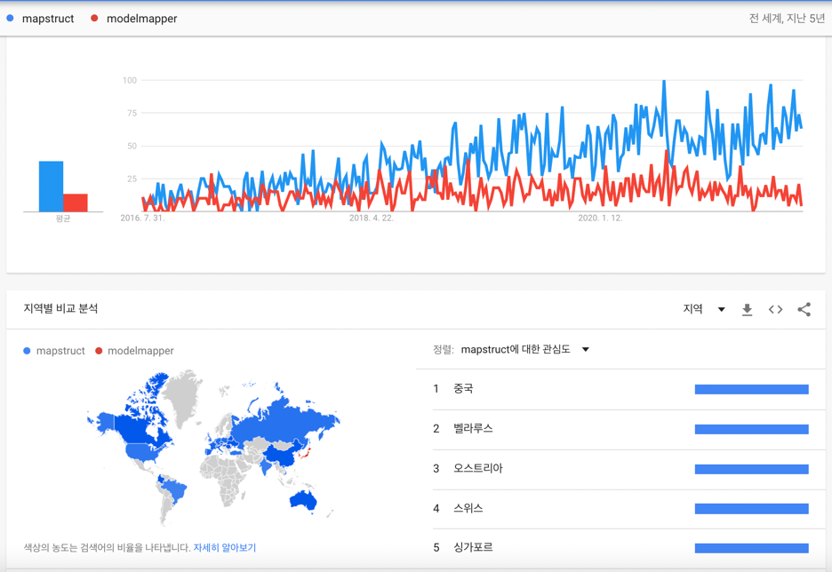
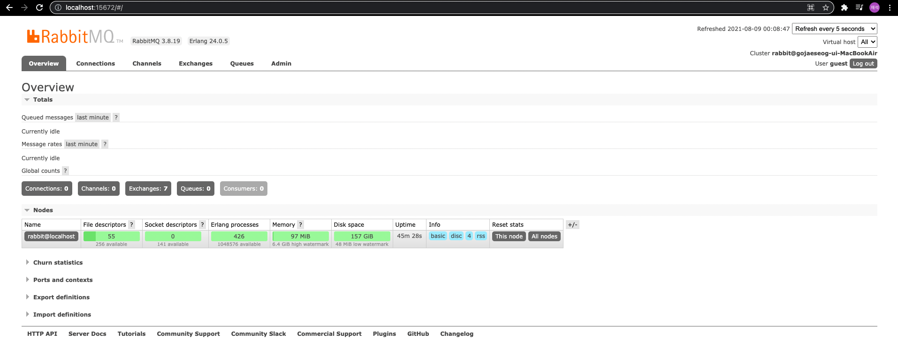

# msa-project

## 마이크로서비스란?
마이크로서비스는 소규모 서비스 단위의 API 통신으로 전체 서비스가 구성된 아키텍입니다. 그렇다면 작은 단위의 백엔드 서버를 여러 개 띄우면 그것이 마이크로서비스일까요? 그건 아닙니다. 그렇다면 마이크로서비스는 기존의 방식과 구체적으로 어떤 차이점이 있는 것인지 비교하며 알아봅시다.

기존의 모놀리식 아키텍처의 경우 모든 요소를 하나의 어플리케이션에 담아서 개발하고 배포했습니다. 모놀리식 아키텍처는 기능 확장에 용이하지 못하고 점점 시스템의 복잡도가 증가하는 등의 문제를 가지고 있었습니다.

그러나 마이크로서비스 아키텍처는 여러 개의 소규모 서비스를 나누어서 관리하기 때문에 확장의 용이성, 장애 격리 등의 장점을 가지고 있습니다.

마이크로서비스를 제대로 구현하기 위해서는 Cloud 기반의 아키텍처와 어플리케이션을 구현해야합니다. 이와 같은 클라우드 네이티브 어플리케이션의 요소로는 마이크로서비스, CI/CD 파이프라인, DevOps, 컨테이너가 있습니다.

 

## 12 Factors
마이크로서비스를 제대로 구현하기 위해서는 클라우드 네이티브 어플리케이션을 개발해야한다고 설명드렸는데, 그 방법에 대한 12가지 항목이 있습니다. 자세한 내용은 아래의 링크를 참고하시면 됩니다.

https://12factor.net/ko/

1. 코드 베이스
2. 종속성
3. 설정
4. 백엔드 서비스
5. 빌드, 릴리즈, 실행
6. 프로세스
7. 포트 바인딩
8. 동시성
9. 폐기 가능
10. 개발/프로덕션 환경 일치
11. 로그
12. 관리자 프로세스

 

## 마이크로서비스 아키텍처 컴포넌트

위의 그림은 마이크로서비스 아키텍처 컴포넌트를 도식화한 그림입니다. 

가장 왼쪽에 클라이언트가 API를 호출하는 부분이 있습니다. 이 경우 API Gateway가 모든 서비스 요청을 받습니다.

이렇게 받은 요청을 알맞은 서비스로 분기하기 위해서 Service Router가 Service Discovery를 참고하여 알맞은 서비스로 분기해줍니다.

그리고 주목해야할 부분은 도커와 같은 컨테이너 기반 가상화 도구를 활용해 CI/CD 파이프라인은 구축한 것을 볼 수 있고, Config Store를 따로 구성해 코드와 설정을 분리했음을 볼 수 있습니다.

마지막으로 마이크로서비스를 모니터링, 진단할 수 있는 도구들을 활용한 것까지 확인할 수 있습니다.

 

## 객체 모델 매퍼 선정

참고 : https://www.baeldung.com/java-performance-mapping-frameworks

ModelMapper -> MapStruct

위에서 제시한 링크에서 average running time, throughput를 비교해본 결과 MapStruct의 성능이 훨씬 좋게 나왔습니다.
그 이유는 ModelMapper의 경우에는 runtime시 매번 object를 reflect하여 메모리를 많이 사용하게 됩니다.
하지만 MapStruct의 경우에는 컴파일 시에 spring context에 mapper를 등록해두고 구현 메소드만 가져다 사용하기 때문에 훨씬 메모리를 덜 사용하고 이것이 성능으로 이어진 것입니다.

또한 구글 트렌드로 확인해본 결과 전 세계적으로 MapStruct를 점점 더 많이 사용하는 추세였습니다.

 

## 비동기 메세지 패턴

출처 : instaclustr.com/rabbitmq-vs-kafka/

MSA에서 마이크로서비스 간 통신을 위해서는 비동기 메세지가 필요한 경우가 있습니다. 이를 지원하는 대표적인 두 개의 플랫폼이 존재하는데, RabbitMQ와 Kafka가 대표적입니다.

두 개의 플랫폼은 확실한 차이를 가지고 있습니다. 하지만 이를 이해하기 전에 비동기 메세지 패턴에 대해 먼저 이해할 필요가 있습니다.

비동기 메세지란 메세지를 생성하는 생성자와 받아서 처리하는 소비자의 관계를 전제로 합니다. 생성자와 소비자가 실시간으로 메세지를 주고 받는 것이 아닙니다. 생성자가 메세지를 생성했지만 소비자가 이를 받아서 처리하지 못하는 경우가 생기기도 합니다. 이러한 경우에는 소비자가 준비가 되기까지 기다렸다가 준비가 된 후 받아서 처리하게 됩니다.이러한 방식을 비동기 메세지 패턴이라고 합니다.

### 메세지 큐 패턴

메세지 큐는 소비자가 준비가 되기 전 메세지를 큐에 담아 놓습니다. 소비자가 준비된다면 큐를 검색하여 적절한 메세지를 받아와서 처리합니다. 각 메세지는 하나의 소비자에 의해 소비됩니다.

### 발행/구독 패턴

소비자는 관심있는 생성자를 구독합니다. 생성자가 발행한 메세지는 해당 생성자를 구독한 소비자들에게 전송됩니다. 이는 메세징 시스템에서 받은 순서대로 소비자에게 전송됩니다.

 

## RabbitMQ

RabbitMQ는 오픈 소스 분산 메세지 브로커 매우 유연하다는 장점을 가졌습니다. 여러 분산 네트워킹 프로토콜을 지원하며 가장 대표적인 프로토콜로는 AMQP가 있습니다.
생성자가 메시지를 큐에 저장해두면 소비자가 메세지를 가져와 처리하는 발행/구독 패턴의 메세지 브로커입니다.

RabbitMQ의 아키텍쳐는 생성자, 교환기, 큐, 소비자로 구성되어있습니다. 생성자가 메세지를 생성하여 교환기로 push하면 교환기가 해당 메세지를 특정 메세지 큐로 라우팅합니다.
생성자는 메세지 큐를 읽어 메세지를 받아옵니다.

RabbitMQ는 메세지를 라우팅하는 4가지 방법을 지원합니다. 직접 교환, 팬아웃 교환, 토픽 교환, 헤더 교환으로 메세지에 담겨있는 라우팅 키나 헤더를 활용하여 라우팅을 수행합니다.

#### Mac OS에서 실행하는 법
1. `brew update`
2. `brew install rabbitmq`
3. `export PATH=$PATH:/usr/local/sbin`
4. `rabbitmq-server`
5. `http://localhost:15672/` 접속
6. ID : guest, PW : guest 입력

