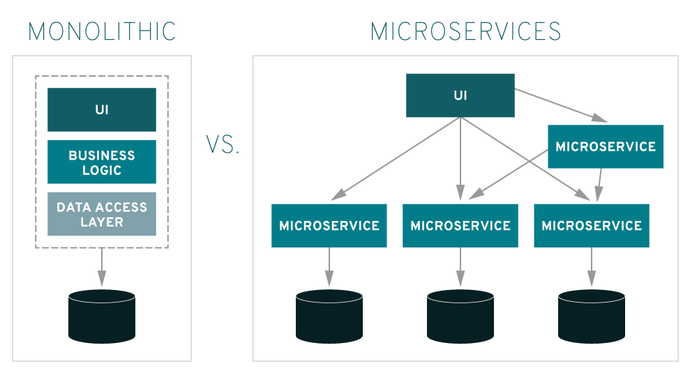
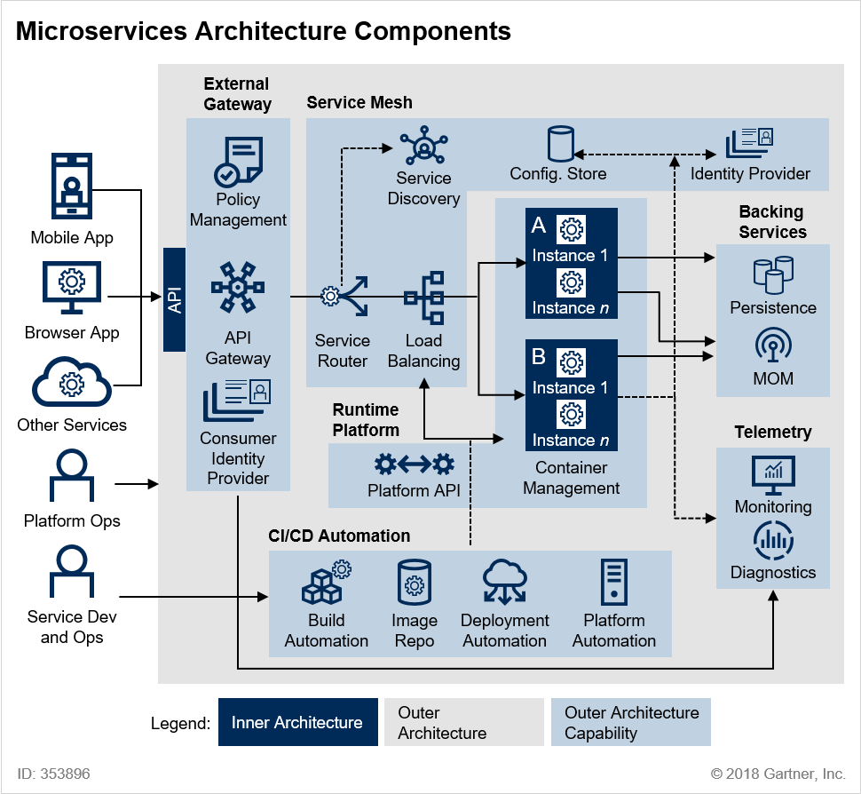

# msa-project

## 마이크로서비스란?
마이크로서비스는 소규모 서비스 단위의 API 통신으로 전체 서비스가 구성된 아키텍입니다. 그렇다면 작은 단위의 백엔드 서버를 여러 개 띄우면 그것이 마이크로서비스일까요? 그건 아닙니다. 그렇다면 마이크로서비스는 기존의 방식과 구체적으로 어떤 차이점이 있는 것인지 비교하며 알아봅시다.

기존의 모놀리식 아키텍처의 경우 모든 요소를 하나의 어플리케이션에 담아서 개발하고 배포했습니다. 모놀리식 아키텍처는 기능 확장에 용이하지 못하고 점점 시스템의 복잡도가 증가하는 등의 문제를 가지고 있었습니다.

그러나 마이크로서비스 아키텍처는 여러 개의 소규모 서비스를 나누어서 관리하기 때문에 확장의 용이성, 장애 격리 등의 장점을 가지고 있습니다.

마이크로서비스를 제대로 구현하기 위해서는 Cloud 기반의 아키텍처와 어플리케이션을 구현해야합니다. 이와 같은 클라우드 네이티브 어플리케이션의 요소로는 마이크로서비스, CI/CD 파이프라인, DevOps, 컨테이너가 있습니다.

 

## 12 Factors
마이크로서비스를 제대로 구현하기 위해서는 클라우드 네이티브 어플리케이션을 개발해야한다고 설명드렸는데, 그 방법에 대한 12가지 항목이 있습니다. 자세한 내용은 아래의 링크를 참고하시면 됩니다.

https://12factor.net/ko/

1. 코드 베이스
2. 종속성
3. 설정
4. 백엔드 서비스
5. 빌드, 릴리즈, 실행
6. 프로세스
7. 포트 바인딩
8. 동시성
9. 폐기 가능
10. 개발/프로덕션 환경 일치
11. 로그
12. 관리자 프로세스

 

## 마이크로서비스 아키텍처 컴포넌트

위의 그림은 마이크로서비스 아키텍처 컴포넌트를 도식화한 그림입니다. 

가장 왼쪽에 클라이언트가 API를 호출하는 부분이 있습니다. 이 경우 API Gateway가 모든 서비스 요청을 받습니다.

이렇게 받은 요청을 알맞은 서비스로 분기하기 위해서 Service Router가 Service Discovery를 참고하여 알맞은 서비스로 분기해줍니다.

그리고 주목해야할 부분은 도커와 같은 컨테이너 기반 가상화 도구를 활용해 CI/CD 파이프라인은 구축한 것을 볼 수 있고, Config Store를 따로 구성해 코드와 설정을 분리했음을 볼 수 있습니다.

마지막으로 마이크로서비스를 모니터링, 진단할 수 있는 도구들을 활용한 것까지 확인할 수 있습니다.